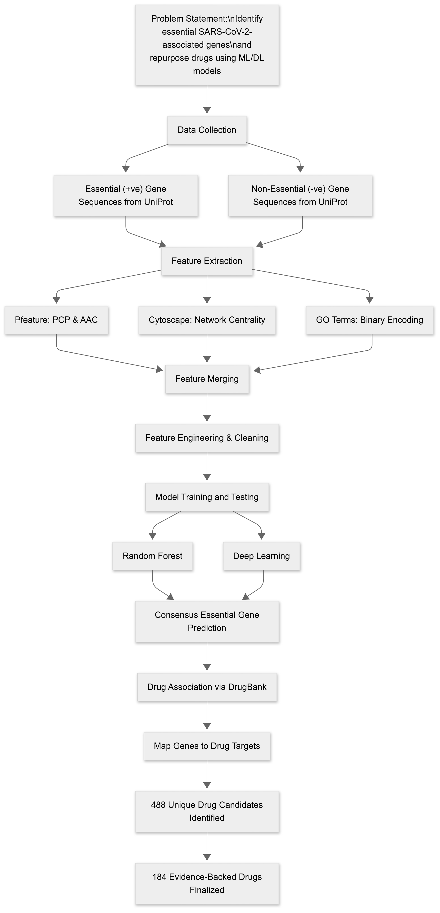

# 🧬 COVID‑19 Drug Repurposing with Machine & Deep Learning

A complete, reproducible pipeline for identifying potential drug targets for COVID‑19 using machine learning (ML) and deep learning (DL).  
This project predicts COVID-19–relevant proteins using engineered features, and maps them to known drugs using UniProt ↔ DrugBank linking for repurposing.

## 📄 Abstract

The COVID-19 pandemic has emphasized the urgent need for rapid therapeutic strategies.  
This study proposes a comprehensive computational pipeline for the prediction of essential genes associated with SARS-CoV-2 infection and subsequent drug repurposing.

We integrated diverse biological features—such as amino acid composition, physicochemical properties, protein–protein interaction centrality, and gene ontology annotations—from UniProt and other curated databases. Forty-four balanced datasets were constructed to ensure model robustness and reduce sampling bias.

Multiple machine learning (ML) and deep learning (DL) classifiers were trained, with Random Forest achieving the best generalization (**test accuracy: 97.04%**, **F1-score: 0.9697**) and selected for downstream analysis. A custom deep neural network model also demonstrated high predictive performance (**test accuracy: 99.26%**).

Post-prediction analysis on 15,600 unlabelled human genes identified 2,290 high-confidence essential genes, 360 druggable targets, and 488 repurposable drugs, 184 of which are supported by prior literature. These results highlight the power of integrative ML/DL approaches for accelerating drug discovery during pandemics.

---

## 🚀 Quick Start

```bash
# clone the repo
git clone https://github.com/your-username/covid19-drug-repurposing-ml.git
cd covid19-drug-repurposing-ml

# create environment and install dependencies
python -m venv env
source env/bin/activate  # on Windows: env\Scripts\activate
pip install -r requirements.txt
```

Then open the Jupyter notebooks in order from the notebooks/ folder to reproduce the pipeline:

- 01_feature_extraction_and_merging_FINAL.ipynb  
- 02_Multi‑Model Classification Pipeline.ipynb  
- 03_gene_prediction_from_models.ipynb  
- 04_drug_repurposing_mapping.ipynb  

---

## 🔗 Pipeline Flowchart




## ⚙️ Tools & Feature Engineering

This project uses a combination of sequence-based, network-based, and ontology-based features derived from the following tools:

- 🧬 **[Pfeature](https://webs.iiitd.edu.in/raghava/pfeature/)** (Standalone): Used for computing protein sequence descriptors including:
  - Amino Acid Composition (AAC)
  - Physicochemical Properties (PCP)

- 🧠 **[Cytoscape](https://cytoscape.org/)**: Used to compute centrality measures from Protein–Protein Interaction (PPI) networks, including:
  - Degree, Betweenness, Closeness centrality
  - PPI network data was analyzed using Cytoscape plugins and exported to CSV
---
### 📚 Citations

- **Pfeature**: Pande A, Patiyal S, et al. *"Pfeature: A Tool for Computing a Wide Range of Protein Features from Sequence and Structure."* Bioinformatics, 2020.
- **Cytoscape**: Shannon P, et al. *"Cytoscape: A Software Environment for Integrated Models of Biomolecular Interaction Networks."* Genome Research, 2003.

## 📁 Repository Structure

```
covid19-drug-repurposing-ml/
├── data/              # Sample input data (FASTA, GO, PPI)
│   ├── raw/
│   ├── processed/
│   └── features/
│
├── notebooks/         # Jupyter notebooks for each pipeline step
│
├── models/            # Trained model files
│   ├── saved_ml_models/
│   │   └── rf_model.pkl
│   └── saved_dl_models/
│       └── model.h5
│
├── results/           # Final outputs: druggable gene–drug mappings
│
├── requirements.txt   # Python dependencies
└── README.md
```

---

## 📚 Data Sources & Licensing

All biological data was obtained from public repositories:

### ✅ UniProt  
Source of protein sequences, GO terms, annotations  
Sample FASTA files provided in `data/raw/`

**Citation:**  
UniProt Consortium. UniProt: the Universal Protein Knowledgebase in 2024.  
Nucleic Acids Research, 52(D1): D80–D88. https://doi.org/10.1093/nar/gkad1052  
**License:** CC BY 4.0

### ✅ DrugBank (sample mapping only)  
Drug identifiers linked to UniProt IDs

**Citation :**  
Wishart DS et al. DrugBank 5.0: A Major Update.  
Nucleic Acids Research, 46(D1): D1074–D1082, 2018. https://doi.org/10.1093/nar/gkx1037

---
---
## 💡 Best Performing Models

The pipeline was evaluated on 44 balanced datasets. Among these:

- ✅ **Random Forest (ML)** on **Dataset 25** showed the best overall performance:
  - Accuracy: **97.04%**
  - F1-score: **0.9697**
  - Precision & Recall: Balanced and consistent

- ✅ **Deep Neural Network (DL)**:
  - Custom architecture using Keras (3 hidden layers + dropout)
  - Test Accuracy: **99.26%**
  - Trained using PCA-reduced features and early stopping for regularization

These two models were selected for final prediction and drug repurposing due to their strong generalization performance.

---


## 🤖 Trained Models

This repository includes only the trained model files for testing and demonstration.

- **ML Model (`/models/saved_ml_models/`)**  
  `rf_model.pkl` — Trained Random Forest classifier for gene classification

- **DL Model (`/models/saved_dl_models/`)**  
  `model.h5` — Trained Keras deep neural network model

⚠️ Preprocessing steps (e.g., scaler, PCA, feature list) are not included.  
You can regenerate these components using the feature engineering and model training notebooks.

---
## 📊 Results Summary

To evaluate the translational potential of the model predictions, a post-prediction drug repurposing analysis was conducted using known drug–gene mappings.

The models were applied to predict essential genes from a pool of ~15,000 **previously unlabeled reviewed human genes** (sourced from UniProt).  
To maintain the integrity of evaluation and avoid data leakage, genes from **Dataset 25** (used in training/testing) were explicitly **excluded** from this pool before prediction.

### 🧬 Gene Prediction
| Model | Predicted Essential Genes |
|-------|----------------------------|
| Machine Learning (ML) | 3,465 |
| Deep Learning (DL)    | 5,203 |
| **Consensus (ML ∩ DL)** | **2,290** |

> These 2,290 genes represent a **high-confidence** set validated by both ML and DL models.

---

### 💊 Druggable Gene Mapping
| Model | Mapped Druggable Genes |
|-------|--------------------------|
| ML    | 468 |
| DL    | 718 |
| **Consensus** | **360** |

> The 360 consensus druggable genes are likely the **most actionable therapeutic targets**.

---

### 💊 Total Unique Drugs Identified
| Model | Unique Drugs Linked |
|-------|----------------------|
| ML    | 591 |
| DL    | 939 |
| **Consensus** | **488** |

> These 488 shared drugs are **prime candidates for repurposing**, with high overlap between both ML and DL models.

---

### ✅ Key Insight

> While DL retrieved a broader range of predictions, the consensus findings across ML and DL provide a **robust and biologically meaningful subset**. These results minimize false positives and highlight **high-confidence drug–gene associations** for further experimental validation and development.

## 📊 Output Files

Key outputs are saved under:

```
results/drug_repurposing/
├── ml_druggable_genes.csv        # ML-predicted genes with known drug matches
├── dl_druggable_genes.csv        # DL-predicted genes with drug matches
└── common_druggable_genes.csv    # Intersection of ML & DL predictions
```

Each file contains predicted Gene ID ↔ DrugBank ID mappings.

---

## 🧠 How to Reproduce Full Results

- Download full SARS-CoV-2 and human protein datasets from UniProt  
- Replace sample files in `data/raw/` with full datasets  
- Update file paths if needed in the notebooks  
- Run all notebooks sequentially to recreate features, models, and drug mappings


## 🙌 Acknowledgments

- 🧬 UniProt for protein and annotation data  
- 💊 DrugBank for drug reference IDs  
- 🛠️ scikit-learn, Keras, NumPy, and the open-source ML community  
- 🧪 Built for research, open-source exploration, and drug discovery education.
